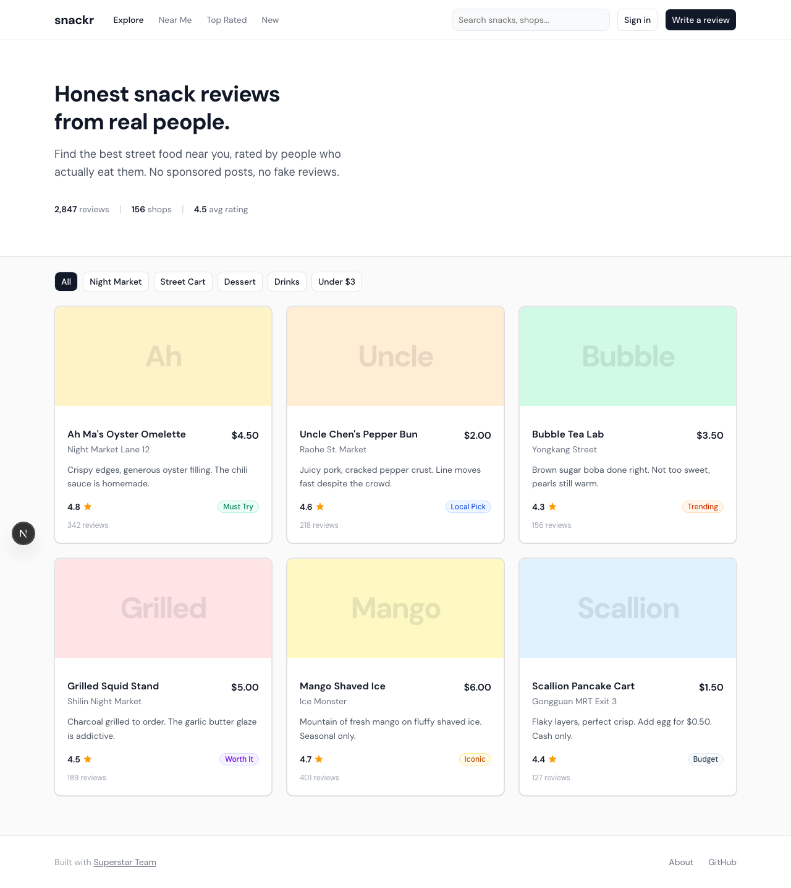
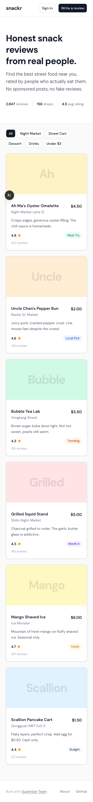
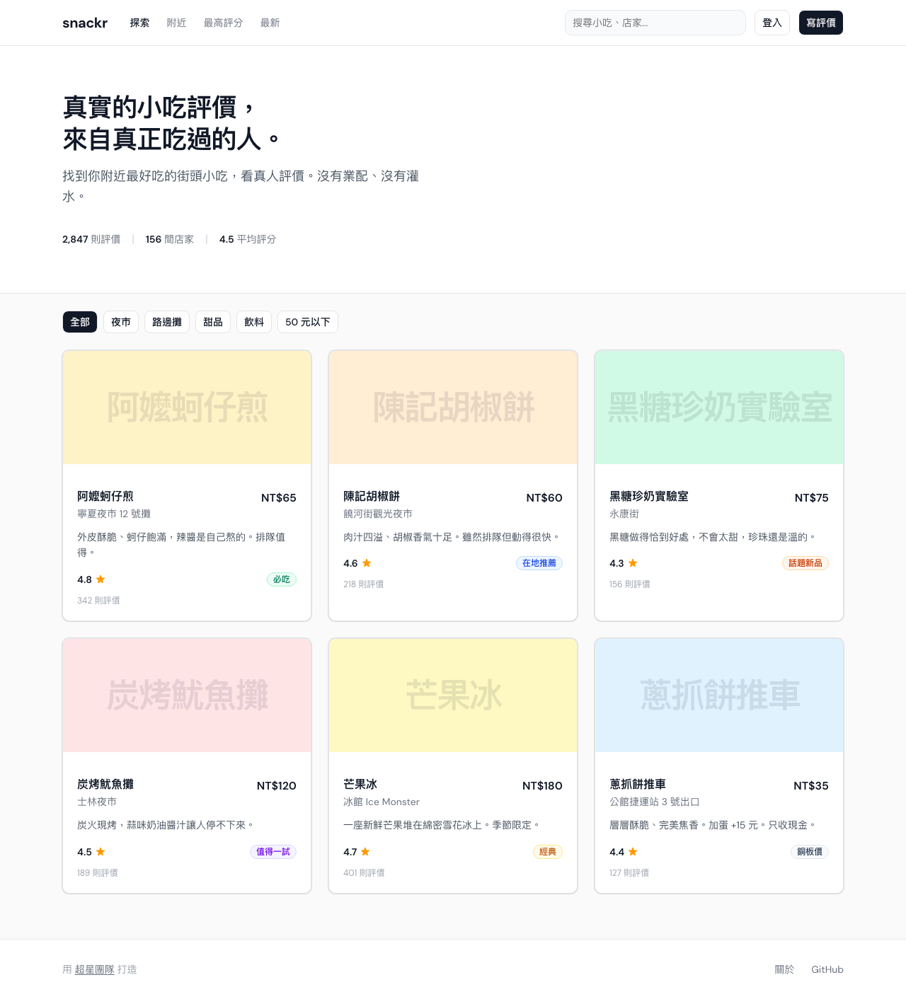
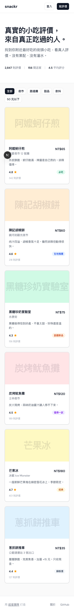

<div align="center">

# SUPERSTAR TEAM

### One command. Five Opus agents. Fully automated delivery.

**A full-stack AI dev team for Claude Code.**

Type `/team`, say what you want, five Opus agents build it simultaneously.

[](https://github.com/XingCEO/superstar-team/actions)
[](LICENSE)
[](https://claude.ai)
[](/)
[](/)

[English](#english) | [繁體中文](#繁體中文)

</div>

---

# English

## Demo: "Build a snack review app"

One `/team` command produced this — no manual design work, no hand-written CSS.



<details>
<summary>Mobile version</summary>



</details>

**What you see:** DM Sans typography, 4px baseline grid spacing, semantic color system, shadcn/ui components, zero emoji icons, zero purple gradients, zero 3-column icon grids.

> **Transparency:** This demo was built by hand following the [515-line design spec](docs/FRONTEND-DESIGN-RULES.md) to show the target quality. It demonstrates what `/team` output looks like when all design rules are followed. A full `/team` end-to-end recording is planned.

---

## What is this

A set of Claude Code config files. After installation, type `/team` and it will:

1. Ask what you want to build (plain language, no tech knowledge needed)
2. Auto-select tech stack, design architecture, define API contracts
3. Auto-design UI: design system, page mockups, production HTML/CSS
4. Launch two Opus agents in isolated git worktrees for parallel frontend + backend
5. Run design verification immediately after frontend completes (score-gated)
6. Post-merge quality gates: code review, cross-model review (Codex), security scan, QA, design check, health check, performance baseline
7. Create PR, update docs, post-deploy monitoring
8. Save learnings (including design decisions) for next time

You just say what you want, confirm the architecture and design, everything else is automatic.

---

## Install

```bash
git clone https://github.com/XingCEO/superstar-team.git
cd superstar-team
./install.sh
```

## Usage

```bash
claude                              # Open Claude Code
/team                               # Launch the team
/team build a snack review app      # Or just say it directly
/status                             # Check what's installed, version updates
```

## Update

Agents and commands are symlinked back to this repo, so:

```bash
cd superstar-team && git pull       # Usually this is enough
```

If you installed an older version (v1.0.x, copy mode), run the upgrade once:

```bash
cd superstar-team && ./update.sh    # Auto-upgrade to symlink mode + update skills
```

`/status` will automatically tell you if there's a new version.

---

## Full Workflow

```
You: "Build a snack review app"

        +===========================+
   1    |   Lead listens            |
        |   Dynamic follow-ups      |
        +===========+===============+
                    |
        +===========================+
   1.5  |   Knowledge base lookup   |
        |   Past learnings          |
        +===========+===============+
                    |
        +===========================+
   2    |   Design pipeline         |
        |   System > Mockups > HTML |
        +===========+===============+
                    | You confirm
        +===========================+
   3    |   Architect (Opus)        |
        |   Tech stack based on     |
        |   design needs            |
        +===========+===============+
                    | You confirm
        +-----------+-----------+
        v                       v
+===============+       +===============+
|  Backend Opus |       |  Frontend Opus|
|  Worktree A   |       |  Worktree B   |
+=======+=======+       +=======+=======+
   4    |                       | 4.5 Design review
        +-----------+-----------+
                    v
        +===========================+
   5    |   Merge + run tests       |
        +===========+===============+
                    v
        +===========================+
   6    |   Quality gates (8)       |
        |   Review > Codex > Security|
        |   > QA > Design > Health  |
        |   > Performance           |
        +===========+===============+
                    v
        +===========================+
   7    |   PR > Docs > Canary      |
        +===========+===============+
                    v
        +===========================+
   8    |   Save learnings          |
        +===========================+
```

---

## What's Included

### 5 Agents

All running Opus with clear responsibilities and file boundaries. No stepping on each other.

| Agent | Role |
|-------|------|
| Architect | Tech stack, architecture, API contracts, task assignment |
| Backend | API, database, business logic (strict API contract compliance) |
| Frontend | UI based on design mockups (strict DESIGN.md + 515-line design rules) |
| Tester | Unit tests, integration tests, API contract validation, coverage |
| Security | Vulnerability scanning, auth review, dependency audit |

### 24 Skills

Auto-loaded when relevant topics come up. Covers database optimization, web performance, accessibility, SEO, git workflows, security audits, diagram generation, and more. Full list in [install.sh](install.sh).

### 3 Commands

| Command | Purpose |
|---------|---------|
| `/team` | Launch the full team |
| `/duo` | Lightweight mode: one planner, one executor |
| `/status` | Check installation, version, knowledge base |

---

## Design Quality

Frontend agent has a built-in 515-line [Anti AI Slop Design Rules](docs/FRONTEND-DESIGN-RULES.md), extracted from 16+ design publications.

| Area | Hard Rules |
|------|-----------|
| Spacing | 4px baseline grid, outer margin >= inner padding |
| Typography | Min 16px body, line-height: headings 1.1-1.2 / body 1.5-1.6 |
| Contrast | Text >= 4.5:1, large text >= 3:1 (WCAG AA) |
| Touch | Targets >= 44x44px |
| Icons | No built-in emoji in UI, use SVG icon libraries (Lucide/Heroicons) |
| Anti-slop | No purple gradients, no 3-col icon grids, no center-everything, no decorative blobs |

Design pipeline: `/design-consultation` > `/design-shotgun` > `/design-html` — design is complete before frontend starts coding.

---

## Safety Mechanisms

| Mechanism | Description |
|-----------|-------------|
| Three strikes | Same error 3 times in a row, agent stops and reports |
| File limit | Must report before modifying 20+ files |
| Package limit | Must report before installing 10+ packages |
| No delete | Unless architecture doc explicitly requires it |
| API contract | Frontend and backend share api-contract.md, changes must go through Lead |
| Design review | Score-gated before merge, below 60 = rejected |
| Cross-model review | Claude reviews first, then Codex independently reviews |
| Progressive launch | 6 sequential steps, Lead checks between each |
| Auto-compact | Context compressed between phases to save tokens |
| Output filtering | Test and build output auto-trimmed |

---

## Knowledge Accumulation

After each `/team` run, architecture decisions, design decisions, pitfalls, and solution patterns are automatically saved to `~/.claude/knowledge/`. Auto-read on next run. Auto-archived after 90 days.

Also saves JSONL training data (including design-related pairs) for future model fine-tuning.

---

## Requirements

- [Claude Code CLI](https://claude.ai)
- Claude Max plan (recommended — five Opus agents consume significant quota)
- git, jq
- Codex CLI (optional, for cross-model review)

## Cost

Each `/team` run uses roughly 5x normal Claude Code tokens. Medium features cost about $5-15. To save costs, you can change agent models from `opus` to `sonnet` for ~40% savings.

---

## FAQ

**Can I use it with an existing codebase?**
Yes. The architect reads your code first and designs around it.

**What if an agent gets stuck?**
Three-strike rule takes over. No infinite token burn.

**Where is knowledge stored?**
`~/.claude/knowledge/`, all local on your machine.

**What about ugly UI?**
The design pipeline completes design system + mockups + HTML before frontend starts. Design review with scoring before merge ensures quality.

**What project types are supported?**
Full-stack web apps, pure API/CLI, frontend-only, marketing sites, refactoring, bug fixes. Lead auto-detects the type and adjusts the workflow.

---

---

# 繁體中文

## 成品展示：「做一個小吃評價 app」

一個 `/team` 指令的產出 — 零手動設計、零手寫 CSS。



<details>
<summary>手機版</summary>



</details>

DM Sans 字型、4px 基線網格、語意化色彩系統、shadcn/ui 元件庫。零 emoji 圖標、零紫色漸層、零三列卡片。

> **說明：** 此 demo 是依照 [515 行設計規範](docs/FRONTEND-DESIGN-RULES.md) 手動建構，展示 `/team` 遵守所有設計規則時的目標品質。完整的 `/team` 端到端錄影正在規劃中。

---

## 這是什麼

一套 Claude Code 的設定檔，裝完之後你打 `/team`，它會：

1. 問你想做什麼（用白話講就好，不用懂技術）
2. 自動選技術棧、設計架構、定 API 契約，讓你確認
3. 自動設計 UI：設計系統、頁面設計稿、生產 HTML/CSS
4. 開兩個 Opus agent 在獨立的 git worktree 裡同時寫前後端
5. 前端完成後立刻做設計驗證（打分制，不及格打回）
6. 合併後跑：程式碼審查、跨模型審查（Codex）、安全掃描、QA、設計確認、健康檢查、效能基線
7. 開 PR、更新文件、部署後監控
8. 把這次學到的東西存起來（含設計決策），下次不用重來

你只要說想做什麼、看一眼架構和設計說 OK，剩下全自動。

---

## 安裝

```bash
git clone https://github.com/XingCEO/superstar-team.git
cd superstar-team
./install.sh
```

## 怎麼用

```bash
claude                              # 打開 Claude Code
/team                               # 啟動團隊
/team 做一個讓人評價小吃的 app        # 或是直接講
/status                             # 看裝了什麼、有沒有新版
```

## 更新

安裝後 agents 和 commands 會 symlink 回這個 repo，所以：

```bash
cd superstar-team && git pull       # 大部分情況這樣就夠了
```

如果你是舊版安裝的（v1.0.x，用複製模式），跑一次升級：

```bash
cd superstar-team && ./update.sh    # 自動升級為 symlink 模式 + 更新 skills
```

`/status` 會自動告訴你有沒有新版。

---

## 完整流程

```
你：「做一個讓人評價小吃的 app」

        +===========================+
   1    |   Lead 聽你說              |
        |   依專案類型動態追問        |
        +===========+===============+
                    |
        +===========================+
   1.5  |   讀取知識庫               |
        |   前人經驗，避免重複踩坑    |
        +===========+===============+
                    |
        +===========================+
   2    |   設計流水線               |
        |   設計系統 > 設計稿 > HTML  |
        +===========+===============+
                    | 你確認
        +===========================+
   3    |   架構師 (Opus)            |
        |   根據設計需求選技術棧      |
        +===========+===============+
                    | 你確認
        +-----------+-----------+
        v                       v
+===============+       +===============+
|  後端 Opus    |       |  前端 Opus     |
|  Worktree A   |       |  Worktree B   |
+=======+=======+       +=======+=======+
   4    |                       | 4.5 設計驗證
        +-----------+-----------+
                    v
        +===========================+
   5    |   合併 + 跑測試            |
        +===========+===============+
                    v
        +===========================+
   6    |   品質閘門（8 關）          |
        |   審查 > Codex > 安全      |
        |   > QA > 設計 > 健康       |
        |   > 效能基線               |
        +===========+===============+
                    v
        +===========================+
   7    |   PR > 文件 > 部署監控     |
        +===========+===============+
                    v
        +===========================+
   8    |   存經驗（含設計決策）      |
        +===========================+
```

---

## 裝了什麼

### 5 個 Agent

全部跑 Opus，各自有明確的職責範圍和檔案邊界，不會互相踩。

| Agent | 做什麼 |
|-------|--------|
| 架構師 | 選技術棧、畫架構、定 API 契約、分工 |
| 後端 | API、資料庫、業務邏輯（嚴格按 API 契約） |
| 前端 | 基於設計稿實作 UI（嚴格按 DESIGN.md + 515 行設計規範） |
| 測試 | Unit test、integration test、API 契約驗證、覆蓋率 |
| 安全 | 漏洞掃描、認證審查、依賴審計 |

### 24 個 Skill

不用手動呼叫，聊天提到相關的事就會自動載入。涵蓋資料庫優化、Web 效能、無障礙、SEO、Git 工作流、安全審計、架構圖生成等。完整清單見 [install.sh](install.sh)。

### 3 個指令

| 指令 | 用途 |
|------|------|
| `/team` | 啟動完整團隊 |
| `/duo` | 輕量版，一個規劃一個執行 |
| `/status` | 看裝了什麼、版本、知識庫 |

---

## 設計品質

前端 agent 內建 515 行[反 AI Slop 設計規範](docs/FRONTEND-DESIGN-RULES.md)，從 16+ 篇設計文獻研究提取。

| 面向 | 硬性規則 |
|------|---------|
| 間距 | 4px 基線網格，外間距 >= 內間距 |
| 排版 | 最小 16px，行高標題 1.1-1.2 / 內文 1.5-1.6 |
| 對比度 | 文字 >= 4.5:1，大文字 >= 3:1 |
| 觸控 | 目標 >= 44x44px |
| 圖標 | 禁止內建 emoji，用 SVG 圖標庫（Lucide / Heroicons） |
| Anti-slop | 禁紫藍漸層、禁 3 列卡片、禁居中一切、禁裝飾性 blob |

設計流水線：`/design-consultation` > `/design-shotgun` > `/design-html`，在前端開工前就完成設計。

---

## 防護機制

| 機制 | 說明 |
|------|------|
| 三振出局 | 同一個錯連續 3 次，agent 停下來回報，不會無限重試 |
| 檔案上限 | 一次改超過 20 個檔案要先回報 |
| 套件上限 | 一次裝超過 10 個套件要先回報 |
| 禁止刪檔 | 除非架構文件明確要求 |
| API 契約 | 前後端共用 api-contract.md，改 API 必須回報 Lead |
| 設計驗證 | 合併前打分，低於 60 分不過 |
| 跨模型審查 | Claude 審完再讓 Codex 獨立審一次 |
| 漸進啟動 | 6 步循序，每步 Lead 檢查才開下一個 |
| 自動壓縮 | 階段之間壓縮 context，省 token |
| 輸出過濾 | 測試和建置的輸出自動裁切 |

---

## 知識累積

每次跑完 `/team` 會自動把這次的架構決策、設計決策、踩過的坑、解法模式存到 `~/.claude/knowledge/`。下次開工會自動讀，不用重新探索。超過 90 天自動歸檔。

另外會存一份 JSONL 格式的訓練資料（含設計相關），以後可以拿去 fine-tune 自己的模型。

---

## 要求

- [Claude Code CLI](https://claude.ai)
- Claude Max 方案（建議，五個 Opus 同時跑很吃額度）
- git、jq
- Codex CLI（可選，跨模型審查用）

## 多少錢

每次 `/team` 大約是平常用 Claude Code 的 5 倍 token。中型功能大概 $5-15 美金。想省的話可以把 agent 的 model 從 `opus` 改成 `sonnet`，省約 40%。

---

## 常見問題

**有現成的專案也能用嗎？**
可以。架構師會先讀你的 code 再設計，不會砍掉重練。

**Agent 卡住怎麼辦？**
三振出局會接管，不會無限燒錢。

**知識存在哪？**
`~/.claude/knowledge/`，全在你電腦上。

**UI 很醜怎麼辦？**
不會。設計流水線在開工前就完成設計系統 + 設計稿 + HTML，前端基於設計稿開發。合併前還有設計驗證打分。

**支援哪些專案類型？**
全端 Web app、純 API / CLI、純前端、行銷站、重構、修 bug。Lead 會自動判斷類型並調整流程。

---

<div align="center">

**Built for shippers.**

</div>
